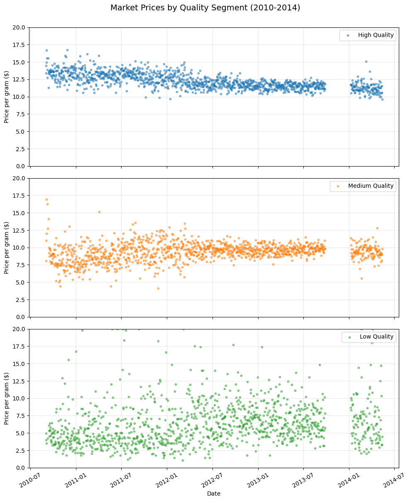
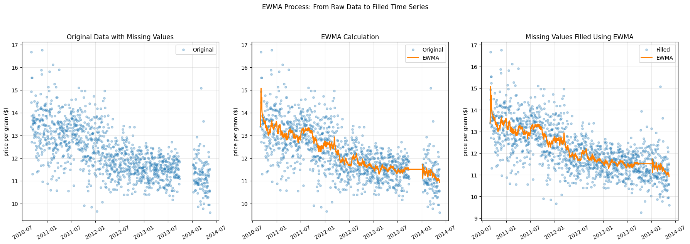
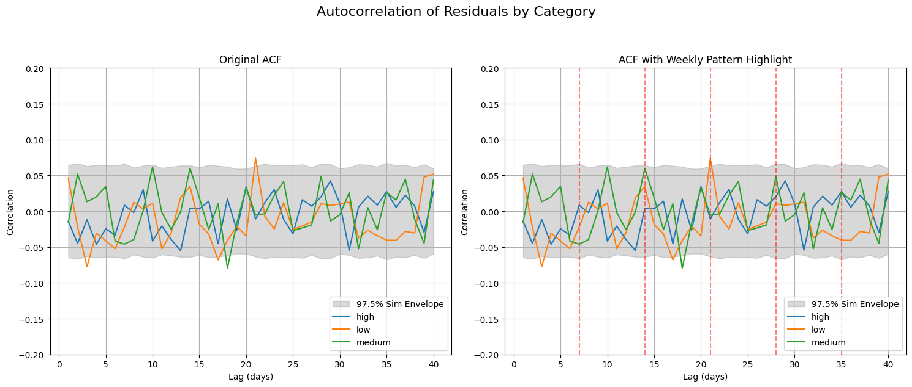

# 📈 Market Price Forecasting using EWMA

This project explores time series forecasting techniques to analyze historical market price trends using Exponentially Weighted Moving Averages (EWMA). The data is based on crowdsourced transaction records collected by political science researcher Zachary M. Jones. The goal is to study how regional prices shift over time, potentially in response to policy decisions.

---

## 📊 Project Overview

Using a simple yet effective linear forecast model built on EWMA smoothing, this analysis includes:

- Daily price changes and volatility metrics
- EWMA of daily differences to establish a trend (slope)
- Linear forecasts extending one year into the future
- Confidence intervals to represent uncertainty over time

The project avoids external dependencies by using standard Python libraries like `pandas`, `matplotlib`, and `statsmodels`.

---

## 🔧 Methodology

1. **Preprocessing**
   Data was cleaned and filtered to focus on a 4-year period (2010–2014).

2. **Trend Estimation**
   - The EWMA of the time series was used to estimate the **intercept**.
   - The EWMA of the daily price difference was used to estimate the **slope**.

3. **Forecasting**
   The model predicts prices using a linear formula:
   `forecast = intercept + slope * Δt`

---

## 📷 Visualizations

### 1. Market Prices by Quality Segment (Raw Data)
Average prices segmented by quality over time.

---

### 2. EWMA Process: From Raw Data to Filled Time Series
Smoothed data using EWMA, allowing for data imputation and trend analysis.

---

### 3. Autocorrelation of Daily/Weekly Price Changes
Sesonality and trend

---

### 4. High-Quality Forecast with 90% Confidence and Prediction Bands
Linear forecast with confidence, prediction and cross-validation intervals.

---

### 5. EWMA One-Year Forecast with 90% Confidence
EWMA forecast with 90% CI and prediction band from bootstrapped simulationsA

---

## 📌 Key Findings

- **Average Daily Change:** –$0.004/day
- **Annualized Trend:** –$1.39 per year
- **95% CI (1-Year Forecast):** ±$1.63
- **MAPE:** 4.7%

---

## 📚 Acknowledgements

- Adapted from **Allen B. Downey's** *Think Stats 2nd Edition*, Chapter 12: Time Series Analysis
- Original data sourced and preprocessed from work by **Zachary M. Jones**, who compiled reports from [Price of Weed](https://www.priceofweed.com/) to study market behavior.

---

## 🧪 Requirements

- Python 3.8+
- `pandas`
- `matplotlib`
- `statsmodels`
